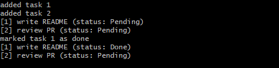

# task-manager-rs

A small CLI task manager: add, list, done, rm. Tasks persist to a JSON
file (tasks.json) in the current working directory.

This is the third version of the same tool. The point of the repo is the
progression, not the tool - same requirements, three implementations, with
the trade-offs written down at each step.

## Demo

## What it does

    task-manager-rs.exe add "write README"
    task-manager-rs.exe list
    task-manager-rs.exe list --pending
    task-manager-rs.exe done <id>
    task-manager-rs.exe rm <id>

State lives in tasks.json, resolved relative to the current working
directory. That is why the CLI is exercised from a temp dir, never from the
repo root - see error-comparison-notes.md for the temp-dir reasoning.

## Step 1 - Python, no tests

argparse subcommands (add / list / complete / delete), JSON persistence,
basic error handling for missing and corrupted files. It worked. "Worked"
meant "worked on the inputs I happened to try."

## Step 2 - Python, tested + CI

Same tool, unit tests written with pytest. Eleven tests: add, list (empty
and non-empty), mark done, delete, missing file, corrupted JSON, duplicate
ids, empty task name, deleting a nonexistent task.

What changed at this step, and why:

- Corrupted-file handling was pulled out of json.load's exception path into
  a custom CorruptedTasksFileError. Before this, a corrupted tasks.json
  surfaced as a raw JSONDecodeError; afterwards the caller catches one
  named exception type.
- GitHub Actions added - python -m pytest -v on every push. This was the
  first time "green" meant something a stranger could verify, not something
  claimed in a README.

The interesting part of this step was not writing the tests. It was that
writing them surfaced behavior the untested version never distinguished:
the missing-file case returned a different result depending on whether the
file was absent versus empty.

## Step 3 - Rust rewrite

Same features, same JSON format, same CLI surface. Rebuilt to feel the
constraint difference: ownership instead of garbage collection, Result
instead of exceptions, a typed Status enum instead of a string field.

Deliberate design choices, not omissions:

- Task derives Serialize / Deserialize but NOT Debug. Debug output on a
  domain type invites printing it in production paths.
- TaskError derives Debug only. Errors carry data; they do not need
  PartialEq unless a test compares them, and none does.
- Status derives Debug / Serialize / Deserialize, no PartialEq. Filtering
  is matches!(task.status, Status::Pending), never ==. Adding PartialEq to
  make a test compile is how a type grows API it does not need.
- .unwrap() is banned in production code. .expect("...") is allowed inside
  test bodies only.
- File-touching tests use a temp_path(name: &str) -> String helper
  (std::env::temp_dir().join(name)), never the literal "tasks.json".

13 tests in a #[cfg(test)] mod tests block at the bottom of src/main.rs,
mirroring the Python suite plus Rust-specific cases: JSON type mismatch,
whitespace-only file, permission-denied on save.

## Error messages: same bad input, both languages

Full notes in error-comparison-notes.md. Short version:

| Input              | Python                                     | Rust                                              |
| ------------------ | ------------------------------------------ | ------------------------------------------------- |
| Missing tasks.json | prints "No tasks found.", exit 0           | silent, exit 0                                    |
| Corrupted file     | traceback, then CorruptedTasksFileError    | one line on stderr with parse position, exit 1    |

The corrupted-file row is the useful contrast. Python's custom error is
raised correctly but not caught in main(), so the user sees roughly twenty
lines of internal frames before the actual message. Rust emits one line,
and serde's message names the exact parse position ("expected ident at
line 1 column 2") - more useful, though it leaks a parser detail. Both
exit 1; only one of them is readable by a human.

## The hardest bug

The permission-denied test. save_tasks_permission_denied_returns_io_error
has to make the target file unwritable, attempt a save, assert the error,
then undo the unwritable state in cleanup. The mechanism is
Permissions::set_readonly, and that call does not mean the same thing on
Windows as it does on Unix.

Two commits mark the resolution. 5ddd7ec corrected the set_readonly(false)
call on Unix - it first appeared as a clippy warning, but the underlying
problem was correctness, not style. The fix then needed a follow-up:
78acc32 re-ran cargo fmt, because the earlier edit had gone in
unformatted.

The lesson that stuck was about test design more than about set_readonly
specifically: a test whose failure depends on platform-specific file
semantics has to be reproducible BEFORE you change anything, otherwise you
are fixing the wrong thing and calling it fixed.

## Why the repo is public

The tool is small. What is worth reading is that the same tool went through
three deliberate versions, with the trade-offs of each step written down.
That is a different signal from a tool built once and left alone.
